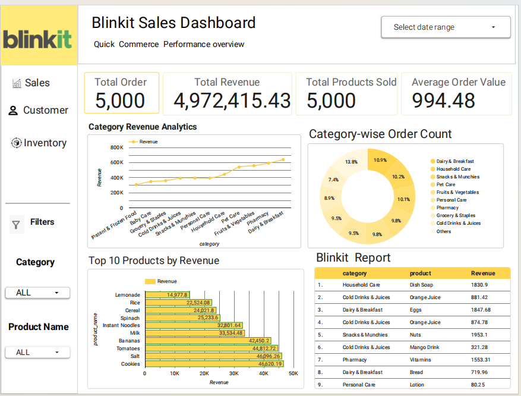
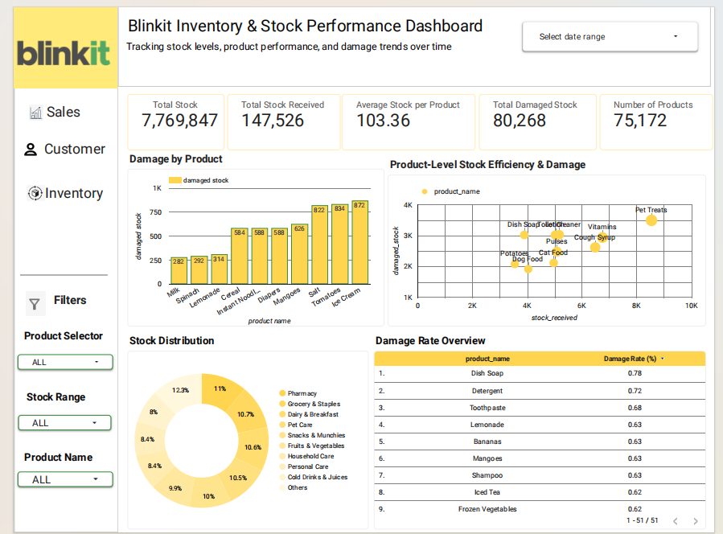
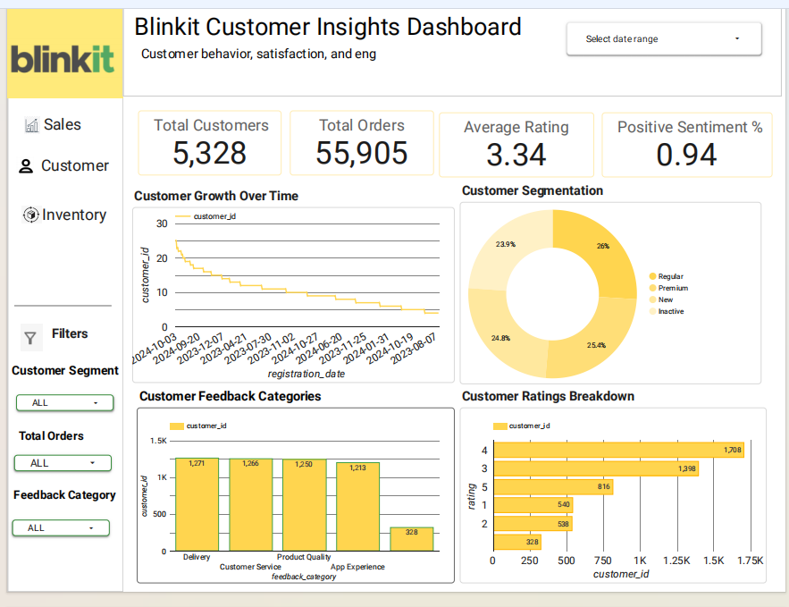

# 📊 Blinkit Dashboard Analysis  
### Sales, Inventory & Customer Insights using Google Looker Studio  

---

## 🟡 Introduction  
In the quick-commerce industry, data plays a crucial role in optimizing operations, improving customer satisfaction, and maximizing revenue.  

This project focuses on building a **multi-page interactive dashboard** to analyze Blinkit’s business performance across:  
- Sales & Revenue  
- Inventory & Stock Efficiency  
- Customer Behavior & Feedback  

---

## 💻 Tech Stack  
- Data Source: Blinkit Dataset  
- Data Preparation: Google Sheets  
- Visualization Tool: Google Looker Studio  

---

## 📄 Dashboard Pages  

---

### 🔹 Page 1: Executive Overview & KPI Metrics  

**Key Metrics:**  
- Total Revenue: ₹4.97M  
- Total Orders: 5,000  
- Average Order Value: ₹994.48  

**Insights:**  
- Essential products dominate revenue  
- Strong customer demand  
- Opportunity in low-performing categories  

---

### 🔹 Page 2: Inventory & Stock Performance  

**Key Metrics:**  
- Total Stock: 7.7M+  
- Damaged Stock: 80K+  

**Insights:**  
- High damage in perishable goods  
- Logistics issues affect even non-perishables  
- Inventory inefficiency leads to revenue loss  

---

### 🔹 Page 3: Customer Insights & Behavior  

**Key Metrics:**  
- Total Customers: 5,328  
- Total Orders: 55,905  
- Average Rating: 3.34  

**Insights:**  
- High engagement but moderate satisfaction  
- Delivery & service are key issues  
- Retention opportunity exists  

---

## 🛠️ Tools & Workflow  

1. Data Collection – Blinkit dataset  
2. Data Cleaning – Google Sheets  
3. Dashboarding – Google Looker Studio  
4. Analysis – Business insights & trends  

---

## 📈 Key Insights  

- Essential goods drive revenue  
- Inventory damage causes losses  
- Customer satisfaction needs improvement  

---

## 🚀 Recommendations  

- Improve inventory handling  
- Optimize delivery operations  
- Focus on customer retention  

---

## 🔗 Project Links  

- Live Dashboard: (Add link)  
- Dataset: (Add link)  

---

## ⭐ If you like this project  
Give it a ⭐ on GitHub!
